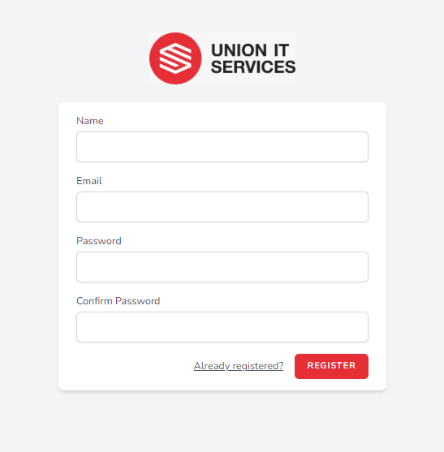
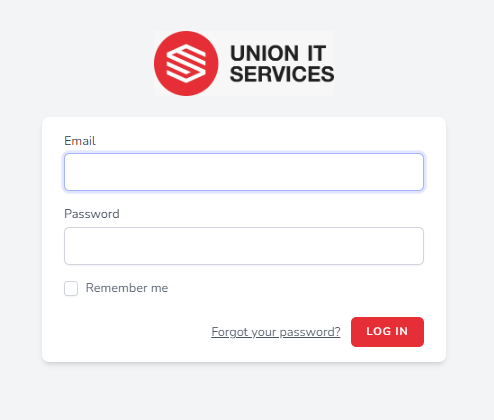
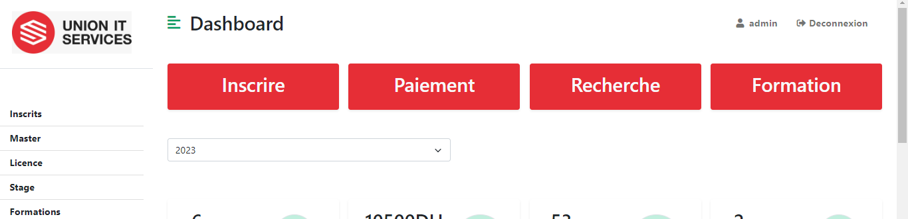
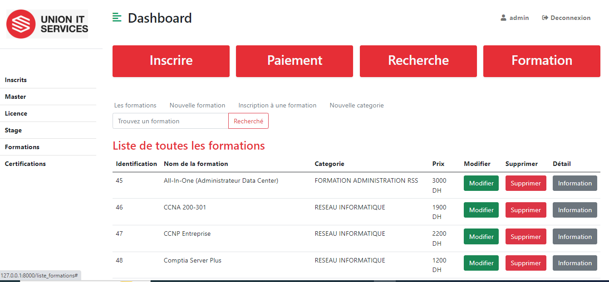
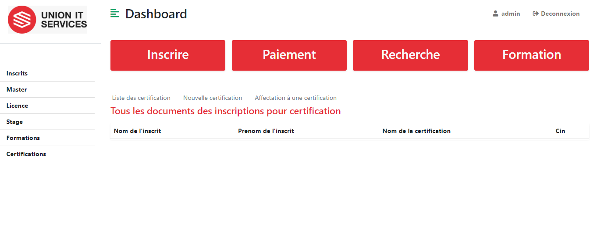
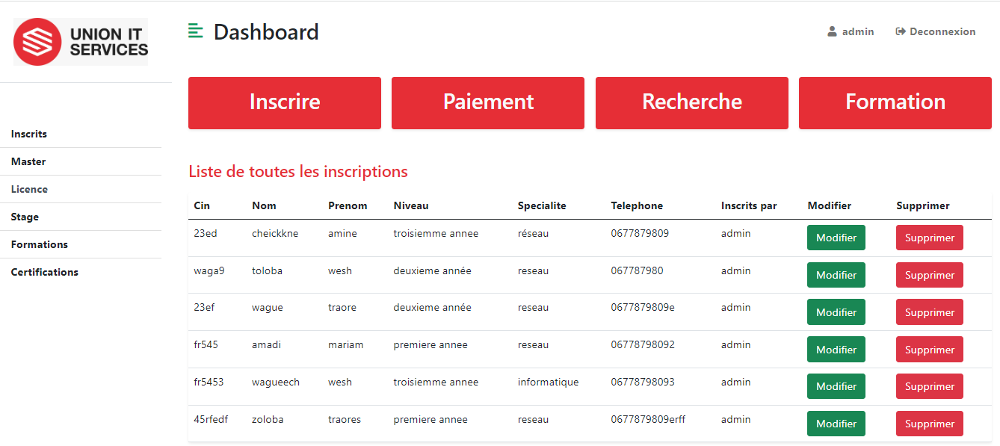
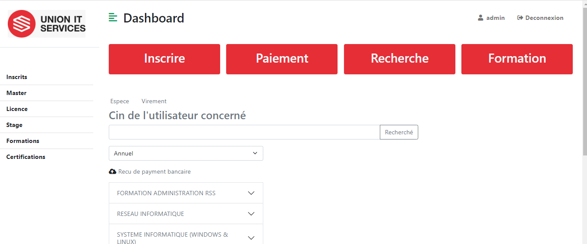
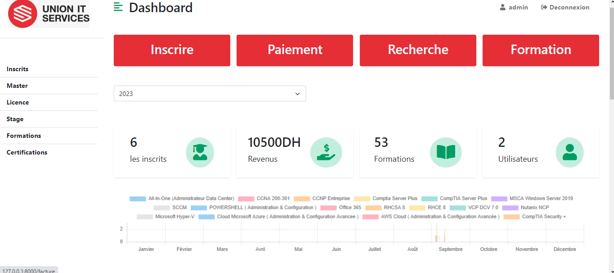
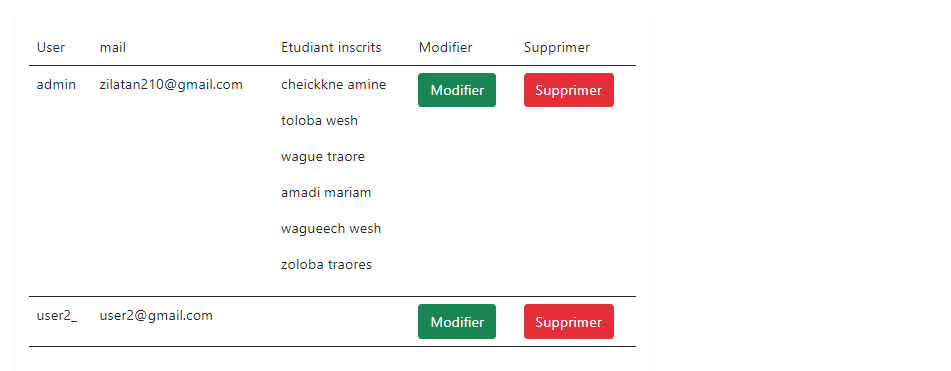
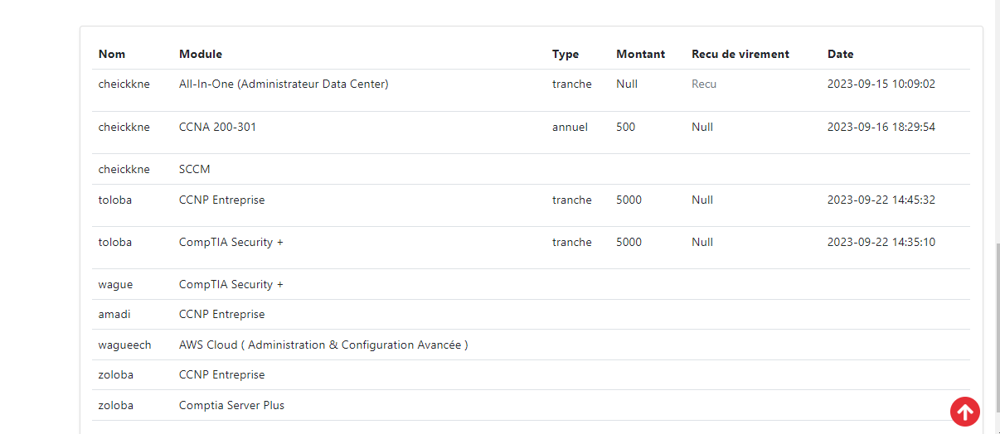

# Application de Gestion interne de UTS
Application interne de gestion complète développée avec Laravel, intégrant des technologies Front-End telles que Tailwind CSS, jQuery et JavaScript. Elle couvre un large éventail de fonctionnalités, dont l'inscription des étudiants, la gestion des formations, des certifications, des utilisateurs, de la paie, des rapports graphiques et un système de notification.
## Interface d'inscription

## Interface d'authentification

## Barre de navigation de l'application

## Liste des formations

## Interface de gestion des catégories

## Interface des certifications

## Formulaire d'inscription des étudiants

## Liste des inscriptions

## Interface de gestion des paiements

## Formulaire de paiement

## Tableau de bord de l'administrateur

